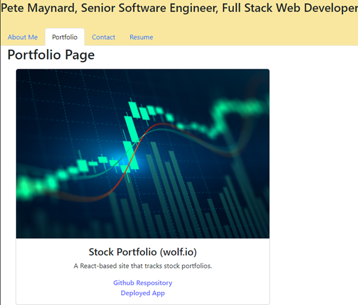

# React Portfolio
Unit 20 React

## Description

A portfolio of various projects I worked on alone or with groups during my Full Stack class.  This is still a work-in-progress.  /
This project uses React and React Router.

## Installation

At command line using top-level directory, run the following command

`>npm create vite@latest`
`>npm install`
`>npm install react-router-dom bootstrap`
`>npm start`

## How to Test

## Screenshot

## Repository at 
https://github.com/petemaynard/React_Portfolio

## Link to Netlify deployment
https://effervescent-bonbon-0516cc.netlify.app/

Created by Pete Maynard

